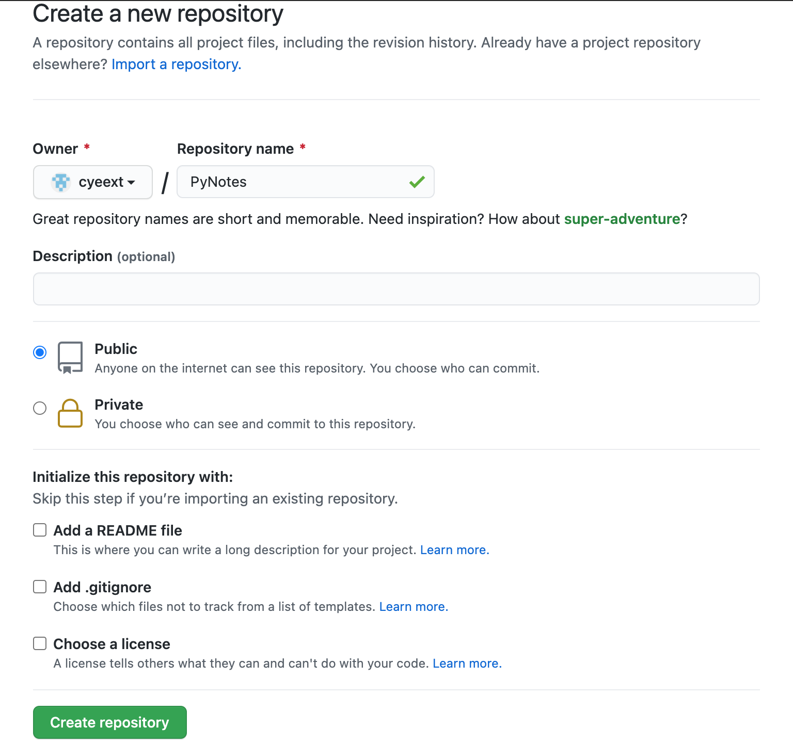

# Github Tutorial

## Introduction

- the most advanced distributed version control system
- coded in C language by Linus and launched in 2005
- what does distributed mean?
  - a complete version library is stored in every local computers
  - a server computer facilitates pushing modifications between computers

## Installing Git and Configuration

### Installing

#### Linux

```shell
sudo apt-get install git
```

#### MacOS

```shell
brew install git
```

### Configuration

open the terminal and execute the following commands:

```shell
git config --global user.name "Your Name"
git config --global user.email "email@example.com"
```

## Create Repository

### What is a Repository

- a repository is a directory where all files can be managed by Git
- Git can generate a timeline of modifications to any file so that you can easily switch between different versions

### Steps to Create One

1. make a target directory and jump to it
2. turn this directory into a repository by `git init` command

### Add Files

- `git add filename`
  - must be executed within a repository

### Commit

- `git commit -m "message"`
- `-m "message"` gives a description of this commit, as meaningful as possible
- must be executed within a repository

### Time Machine

#### Check current status

- `git status` command
  - check wether any files are modified
    - changed but aren't added --> `Changes not staged for commit:`
    - added but not committed --> `Changes to be committed:`
    - committed --> `nothing to commit, working tree clean
- 'git diff' command
  - check the modifications in detail

#### Switch between versions

- `git log` command
  - show all historical versions chronologically
- `git reset --hard version` command
  - switch between versions
  - *version* can be:
    - `HEAD`: current version
    - `HEAD^`: the former one
    - `HEAD^^`: the one before the former one
    - `HEAD~n`: counting backwards, nth one
    - part of the the commit id (Git can search automatically)
- `git reflog`
  - check historical commands
  - useful to find back the commit number

#### Working Directory, Stage

- working directory (工作区)
  - parent directory of *.git*
- repository directory (版本库)
  - *.git* directory
  - stage (暂存区)
    - stores all modification passed by `git add` command
  - *master* branch
    - first branch automatically created by Git


#### Discard Modification

- `git check -- file`
  - roll back to the latest repository (`git commit` or `git add`) version

#### Delete Files

- `git rm filename` --> `git commit -m "message"`
  - deletes the file in the repository

- `git checkout -- filename`
  - restores the file deleted mistakenly with the repository one

## Remote Repository

### Link GitHub

1. create ssh key through

```shell
ssh-keygen -t rsa -C "youremail@example.com"
```

2. Login Github --> Account settings --> SSH and GPG keys -->
paste the contents of `~\.ssh\id_rsa.pub` into the key textbox
--> add key

### Create Remote Repositories

1. create a new repo on Github

2. link with the local one (*origin*: conventional name for the remote repo)

```shell
git remote add origin git@github.com:cyeext/PyNotes.git
```

3. push the contents of the local master to the remote master and link both (`-u`)

```shell
git push -u origin master
```

### Clone from Remote repo

```shell
git clone git@github.com:cyeext/PyNotes.git
```

